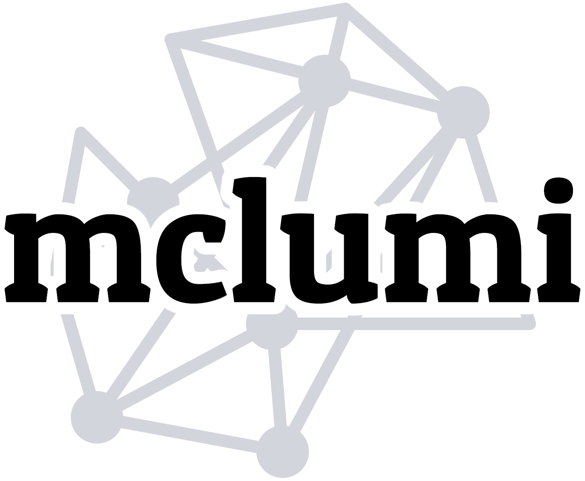
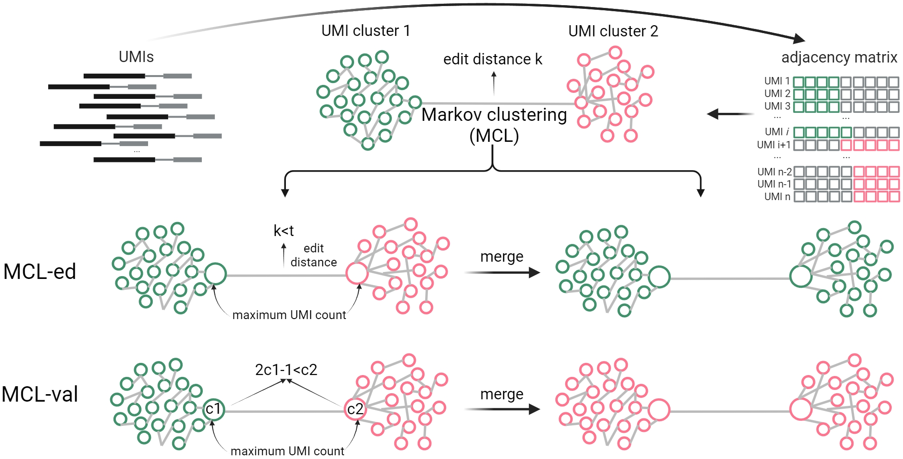

# Welcome to the homepage of { width="40" }mclUMI!

!!! quote "What is it?"

    For UMI collapsing/deduplication


mclUMI is a toolkit developed by using the Markov clustering (MCL) network-based algorithm for correcting UMI errors and thus precisely counting unique UMIs. mclUMI is implemented with Python.

<figure markdown="span">
  { width="800" }
  <figcaption><strong>Fig</strong> 1. Schematic of mclUMI for UMI deduplication</figcaption>
</figure>


## Features

There is a summary for technical features of mclUMI.

!!! tip "Technical features"

    It provides 4 modules for UMI deduplication, including 
    
        dedup_basic, dedup_pos, dedup_gene, and dedup_sc
    
    Each module for UMI deduplication includes 7 algorithms

        mcl, mcl_ed, mcl_val, unique, cluster, adjacency, and directional

    Each takes as input the alignment result in a bam file and outputs a UMI-deduplicated alignment in a new bam file and another 2 summary files.

- [x] Algorithm category
    * [x] Graph-based UMI collapsing
    * [x] Euclidean distance-based UMI collapsing
- [x] Installation package
    * [x] PyPI
    * [x] Conda
    * [x] Docker
    * [x] Github
- [x] Sequencing level
    * [x] Single genomic locus
    * [x] Bulk RNA-seq
    * [x] single-cell (sc) RNA-seq

## Programming

mclUMI provides two user-friendly interfaces to run internally (Python inline) or externally (CLI).

* `language` - Python
* `module` - Object Oriented Programming (OOP)
* `command` - Python and Shell

In Python
``` py
import mclumi as mu

mu.onepos
mu.multipos
mu.gene
mu.sc
...
```

In Shell

``` sh
$ mclumi [module | str] \
-m [method | str] \
-ed [edit distance | int]  \
-pfpn [yaml file | str] \
-bfpn [bam file | str] \
-wd [output path | str] \
-vb [if verbose | boolean]
```