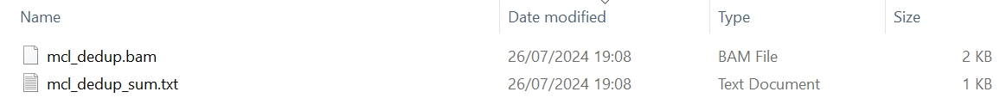

`mclumi.onepos` is a module used for deduplicating UMIs observed at a single genomic locus or a single gene.

# Usage

The `mclumi.onepos` module can be used in Python and Shell.

## 1. Python

### 1.1 Command

=== "MCL"

    ``` py linenums="1"
    import mclumi as mu
    
    df_mcl = mu.onepos.mcl(
        bam_fpn=to('data/example_bundle.bam'),
        ed_thres=1,
        work_dir=to('data/'),
        verbose=False,  # False True

        heterogeneity=False,  # False True

        inflat_val=1.6,
        exp_val=2,
        iter_num=100,
    )

    print(df_mcl)

    ```

=== "MCL-val"

    ``` py linenums="1"
    import mclumi as mu
    
    df_mcl_val = mu.onepos.mcl_val(
        bam_fpn=to('data/example_bundle.bam'),
        ed_thres=1,
        work_dir=to('data/'),
        verbose=False,  # False True

        heterogeneity=False,  # False True

        mcl_fold_thres=1.5,
        inflat_val=1.6,
        exp_val=2,
        iter_num=100,
    )

    print(df_mcl_val)

    ```

=== "MCL-ed"

    ``` py linenums="1"
    import mclumi as mu
    
    df_mcl_ed = mu.onepos.mcl_ed(
        bam_fpn=to('data/example_bundle.bam'),
        ed_thres=1,
        work_dir=to('data/'),
        verbose=False,  # False True

        heterogeneity=False,  # False True

        mcl_fold_thres=1.5,
        inflat_val=1.6,
        exp_val=2,
        iter_num=100,
    )

    print(df_mcl_ed)
    ```

=== "Unique"

    ``` py linenums="1"
    import mclumi as mu
    
    df_unique = mu.onepos.unique(
        bam_fpn=to('data/example_bundle.bam'),
        ed_thres=1,
        work_dir=to('data/'),
        verbose=False,  # False True

        heterogeneity=False,  # False True
    )

    print(df_unique)
    
    ```

=== "Cluster"

    ``` py linenums="1"
    import mclumi as mu
    
    df_cluster = mu.onepos.cluster(
        bam_fpn=to('data/example_bundle.bam'),
        ed_thres=1,
        work_dir=to('data/'),
        verbose=False,  # False True

        heterogeneity=False,  # False True
    )

    print(df_cluster)

    ```

=== "Adjacency"

    ``` py linenums="1"
    import mclumi as mu
    
    df_adjacency = mu.onepos.adjacency(
        bam_fpn=to('data/example_bundle.bam'),
        ed_thres=1,
        work_dir=to('data/'),
        verbose=False,  # False True

        heterogeneity=False,  # False True
    )

    print(df_adjacency)

    ```

=== "Directional"

    ``` py linenums="1"
    import mclumi as mu
    
    df_directional = mu.onepos.directional(
        bam_fpn=to('data/example_bundle.bam'),
        ed_thres=1,
        work_dir=to('data/'),
        verbose=False,  # False True

        heterogeneity=False,  # False True
    )

    print(df_directional)

    ```

### 1.2 Attributes in the YAML file

!!! Illustration

    | Attribute        | Description                          |
    |:-----------------| :----------------------------------- |
    | `ed_thres`       | edit distance |
    | `bam_fpn`        | input file in the BAM format |
    | `heterogeneity`  | mode to indicate if studying trajectories of UMI origins and copies/derivatives across a series of PCR amplication cycles. If `heterogeneity` is set to `True`, users will gain more statistics and files in the final output directory |
    | `inflat_val`     | inflation parameter of the Markov Clustering algorithm |
    | `exp_val`        | expansion parameter of the Markov Clustering algorithm |
    | `iter_num`       | number of interations for the Markov Clustering algorithm to converge |
    | `mcl_fold_thres` | a fold change threshold for MCL at a range of (1, `l`) where `l` is the length of a UMI. This parameter is placed when the `mcl_ed` or `mcl_val` function is used. |
    | `verbose`        | whether to print intermediate results |
        

## 2. Shell

### 2.1 Command
The shell command is simplified, but more parameters should be specified in a YAML file, `params.yml` in order to reduce complexity but optimise future extension.
``` c++ linenums="1"
mclumi locus \
-m mcl \
-ed 1  \
-pfpn ./mclumi/data/params.yml \
-bfpn ./mclumi/data/example_bundle.bam \
-wd ./mclumi/data/ \
-vb True
```

### 2.2 Attributes in the command

!!! Illustration

    | Attribute     | Description                          |
    |:--------------| :----------------------------------- |
    | `-m`          | UMI deduplication method |
    | `-ed`         | edit distance |
    | `-pfpn`       | YAML parameter file. Please see the **`YAML`** tab for parameter details |
    | `-bfpn`       | input file in the BAM format |
    | `-wd`         | working directory |
    | `-vb`         | whether to print intermediate results |


### 2.3 YAML file configuration

``` yaml
work_dir: /mnt/d/Document/Programming/Python/mclumi/mclumi/data/

# bam_fpn: /mnt/d/Document/Programming/Python/mclumi/mclumi/data/example_bundle.bam

umi:
  ed_thres: 1

dedup:
  # mcl_val
  mcl_fold_thres: 1.
  inflat_val: 1.1
  exp_val: 2
  iter_num: 100

  # mcl_ed
  mcl_fold_thres: 1.6
  inflat_val: 1.1
  exp_val: 2
  iter_num: 100

```

### 2.4 Attributes in the YAML file

!!! Illustration

    | Attribute      | Description                          |
    | :---------- | :----------------------------------- |
    | `work_dir` | working directory |
    | `ed_thres` | edit distance |
    | `inflat_val` | inflation parameter of the Markov Clustering algorithm |
    | `exp_val` | expansion parameter of the Markov Clustering algorithm |
    | `iter_num` | number of interations for the Markov Clustering algorithm to converge |
    | `mcl_fold_thres` | a fold change threshold for MCL at a range of (1, `l`) where `l` is the length of a UMI. This parameter is placed when the `mcl_ed` or `mcl_val` function is used. |

# Output

## 1. Console

```shell
                   ____  ____  _______
   ____ ___  _____/ / / / /  |/  /  _/
  / __ `__ \/ ___/ / / / / /|_/ // /  
 / / / / / / /__/ / /_/ / /  / // /   
/_/ /_/ /_/\___/_/\____/_/  /_/___/   
                                      

26/07/2024 18:49:19 logger: ===>You are using method MCL to deduplicate UMIs observed at a genomic loci.
26/07/2024 18:49:19 logger: ===>reading the bam file... /mnt/d/Document/Programming/Python/mclumi/mclumi/data/example_bundle.bam
26/07/2024 18:49:19 logger: ===>reading BAM time: 0.00s
26/07/2024 18:49:19 logger: =========>start converting bam to df...
26/07/2024 18:49:27 logger: =========>time to df: 7.235s
26/07/2024 18:49:27 logger: ======># of raw reads: 1175027
26/07/2024 18:49:27 logger: ======># of reads with qualified chrs: 1175027
26/07/2024 18:49:27 logger: ======># of unique umis: 1949
26/07/2024 18:49:27 logger: ======># of redundant umis: 1175027
26/07/2024 18:49:27 logger: ======>edit distance thres: 1
26/07/2024 18:49:27 logger: ======># of columns in the bam df: 14
26/07/2024 18:49:27 logger: ======>Columns in the bam df: ['id', 'query_name', 'flag', 'reference_id', 'genome_pos', 'mapping_quality', 'cigar', 'query_sequence', 'next_reference_id', 'next_reference_start', 'query_qualities', 'read', 'umi', 'source']
26/07/2024 18:49:27 logger: ======># of raw reads:
              id                     query_name  ...        umi  source
0              0  SRR2057595.11715337_ACCGGTTTA  ...  ACCGGTTTA       1
1              1  SRR2057595.11715337_ACCGGTTTA  ...  ACCGGTTTA       1
2              2  SRR2057595.11715337_ACCGGTTTA  ...  ACCGGTTTA       1
3              3  SRR2057595.11715337_ACCGGTTTA  ...  ACCGGTTTA       1
4              4  SRR2057595.11715337_ACCGGTTTA  ...  ACCGGTTTA       1
...          ...                            ...  ...        ...     ...
1175022  1175022   SRR2057595.8512200_ACCGGTTGG  ...  ACCGGTTGG       1
1175023  1175023   SRR2057595.8512200_ACCGGTTGG  ...  ACCGGTTGG       1
1175024  1175024   SRR2057595.8512200_ACCGGTTGG  ...  ACCGGTTGG       1
1175025  1175025   SRR2057595.8512200_ACCGGTTGG  ...  ACCGGTTGG       1
1175026  1175026   SRR2057595.8512200_ACCGGTTGG  ...  ACCGGTTGG       1

[1175027 rows x 14 columns]
26/07/2024 18:49:27 logger: ===>start building umi graphs...
26/07/2024 18:49:31 logger: ===>time for building umi graphs: 3.99s
1    {0: [0, 77, 97, 153, 239, 433, 518, 562, 930, ...
Name: mcl, dtype: object
===>Analysis has been complete and results have been saved!
                                            vignette  ...                                        mcl_bam_ids
1  {'graph_adj': {0: [77, 81, 97, 153, 205, 228, ...  ...  [1980, 45509, 93558, 17999, 50319, 3664, 44368...

[1 rows x 12 columns]
```

## 2. Understanding results
After running, the generated files are shown in the following screenshot.

<figure markdown="span">
  { width="800" }
  <figcaption><strong>Fig</strong> 1. Generated files with MCL</figcaption>
</figure>

In the output directory, there are two files:

!!! info "Annotation"

    * **`{method}_dedup_sum.txt`** - deduplicated UMI counts across all reads in the newly generated bam file.
    * **`{method}_dedup.bam`** - in which the deduplicated reads will be stored.

Statistics provided in file `mcl_dedup_sum.txt` are tabulated as follow:

| index   | {method}_umi_len | ave_eds | uniq_umi_len | dedup_uniq_diff_pos | dedup_read_diff_pos |
|:--------|:-----------------|:--------|:-------------|:--------------------|:--------------------|
| 1       | 44               | 5.0     | 1949         | 1905                | 1116981             |


!!! info "Annotation"

    * **`the 1st column`** - the given locus.
    * **`the 2nd column`** - deduplicated UMI counts (corresponding to the number of DNA molecules/transcripts) at the given locus.
    * **`the 3rd column`** - average edit distances between UMIs at the given locus.
    * **`the 4th column`** - unique UMI counts at the given locus.
    * **`the 5th column`** - difference in dedup UMI counts and original unique UMI counts.
    * **`the 6th column`** - difference in the number of dedup reads and original reads.