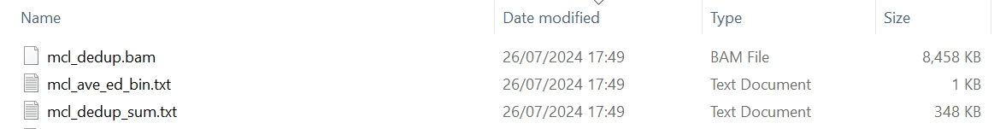

`mclumi.gene` is a module used for deduplicating UMIs aligned to genes at the bulk RNA-seq levels.

# Usage

The `mclumi.gene` module can be used in Python and Shell.

## 1. Python

### 1.1 Command

=== "MCL"

    ``` py linenums="1"
    import mclumi as mu
    
    df_mcl = mu.gene.mcl(
        bam_fpn=to('data/hgmm_100_STAR_FC_sorted.bam'),
        ed_thres=1,
        gene_assigned_tag='XT',
        gene_is_assigned_tag='XS',
        work_dir=to('data/'),
        verbose=False,  # False True

        heterogeneity=False,  # False True

        inflat_val=1.6,
        exp_val=2,
        iter_num=100,
    )

    print(df_mcl)

    ```

=== "MCL-val"

    ``` py linenums="1"
    import mclumi as mu
    
    df_mcl_val = mu.gene.mcl_val(
        bam_fpn=to('data/hgmm_100_STAR_FC_sorted.bam'),
        ed_thres=1,
        gene_assigned_tag='XT',
        gene_is_assigned_tag='XS',
        work_dir=to('data/'),
        verbose=False,  # False True

        heterogeneity=False,  # False True

        mcl_fold_thres=1.5,
        inflat_val=1.6,
        exp_val=2,
        iter_num=100,
    )

    print(df_mcl_val)

    ```

=== "MCL-ed"

    ``` py linenums="1"
    import mclumi as mu
    
    df_mcl_ed = mu.gene.mcl_ed(
        bam_fpn=to('data/hgmm_100_STAR_FC_sorted.bam'),
        ed_thres=1,
        gene_assigned_tag='XT',
        gene_is_assigned_tag='XS',
        work_dir=to('data/'),
        verbose=False,  # False True

        heterogeneity=False,  # False True

        mcl_fold_thres=1.5,
        inflat_val=1.6,
        exp_val=2,
        iter_num=100,
    )

    print(df_mcl_ed)
    ```

=== "Unique"

    ``` py linenums="1"
    import mclumi as mu
    
    df_unique = mu.gene.unique(
        bam_fpn=to('data/hgmm_100_STAR_FC_sorted.bam'),
        ed_thres=1,
        gene_assigned_tag='XT',
        gene_is_assigned_tag='XS',
        work_dir=to('data/'),
        verbose=False,  # False True

        heterogeneity=False,  # False True
    )

    print(df_unique)
    
    ```

=== "Cluster"

    ``` py linenums="1"
    import mclumi as mu
    
    df_cluster = mu.gene.cluster(
        bam_fpn=to('data/hgmm_100_STAR_FC_sorted.bam'),
        ed_thres=1,
        gene_assigned_tag='XT',
        gene_is_assigned_tag='XS',
        work_dir=to('data/'),
        verbose=False,  # False True

        heterogeneity=False,  # False True
    )

    print(df_cluster)

    ```

=== "Adjacency"

    ``` py linenums="1"
    import mclumi as mu
    
    df_adjacency = mu.gene.adjacency(
        bam_fpn=to('data/hgmm_100_STAR_FC_sorted.bam'),
        ed_thres=1,
        gene_assigned_tag='XT',
        gene_is_assigned_tag='XS',
        work_dir=to('data/'),
        verbose=False,  # False True

        heterogeneity=False,  # False True
    )

    print(df_adjacency)

    ```

=== "Directional"

    ``` py linenums="1"
    import mclumi as mu
    
    df_directional = mu.gene.directional(
        bam_fpn=to('data/hgmm_100_STAR_FC_sorted.bam'),
        ed_thres=1,
        gene_assigned_tag='XT',
        gene_is_assigned_tag='XS',
        work_dir=to('data/'),
        verbose=False,  # False True

        heterogeneity=False,  # False True
    )

    print(df_directional)

    ```

### 1.2 Attributes in the YAML file

!!! Illustration

    | Attribute      | Description                          |
    | :---------- | :----------------------------------- |
    | `ed_thres` | edit distance |
    | `gene_assigned_tag` | to enable deduplication on the gene tag (XT recommended). Any other tag if you know what tags the reads in your provided BAM file. |
    | `gene_is_assigned_tag` | to check if reads are assigned the gene tag (XS recommended) |
    | `bam_fpn` | input file in the BAM format |
    | `heterogeneity` | mode to indicate if studying trajectories of UMI origins and copies/derivatives across a series of PCR amplication cycles. If `heterogeneity` is set to `True`, users will gain more statistics and files in the final output directory |
    | `inflat_val` | inflation parameter of the Markov Clustering algorithm |
    | `exp_val` | expansion parameter of the Markov Clustering algorithm |
    | `iter_num` | number of interations for the Markov Clustering algorithm to converge |
    | `mcl_fold_thres` | a fold change threshold for MCL at a range of (1, `l`) where `l` is the length of a UMI. This parameter is placed when the `mcl_ed` or `mcl_val` function is used. |
    | `verbose` | whether to print intermediate results |
        

## 2. Shell

### 2.1 Command
The shell command is simplified, but more parameters should be specified in a YAML file, `params.yml` in order to reduce complexity but optimise future extension.
``` c++ linenums="1"
mclumi bulk \
-m mcl \
-ed 1  \
-pfpn ./mclumi/data/params.yml \
-bfpn ./mclumi/data/RM82CLK1_S3_featurecounts_gene_sorted.bam \
-wd ./mclumi/data/ \
-vb True
```

### 2.2 Attributes in the command

!!! Illustration

    | Attribute      | Description                          |
    | :---------- | :----------------------------------- |
    | `-m` | UMI deduplication method |
    | `-ed` | edit distance |
    | `-pfpn` | YAML parameter file. Please see the **`YAML`** tab for parameter details |
    | `-bfpn` | input file in the BAM format |
    | `-wd` | working directory |
    | `-vb` | whether to print intermediate results |


### 2.3 YAML file configuration

``` yaml
work_dir: /mnt/d/Document/Programming/Python/mclumi/mclumi/data/

# bam_fpn: /mnt/d/Document/Programming/Python/mclumi/mclumi/data/example_bundle.bam

tag:
  # bulk
  gene_assigned_tag: XT
  gene_is_assigned_tag: XS

umi:
  ed_thres: 1

dedup:
  # mcl_val
  mcl_fold_thres: 1.
  inflat_val: 1.1
  exp_val: 2
  iter_num: 100

  # mcl_ed
  mcl_fold_thres: 1.6
  inflat_val: 1.1
  exp_val: 2
  iter_num: 100

```

### 2.4 Attributes in the YAML file

!!! Illustration

    | Attribute      | Description                          |
    | :---------- | :----------------------------------- |
    | `work_dir` | working directory |    
    | `ed_thres` | edit distance |
    | `gene_assigned_tag` | to enable deduplication on the gene tag (XT recommended). Any other tag if you know what tags the reads in your provided BAM file. |
    | `gene_is_assigned_tag` | to check if reads are assigned the gene tag (XS recommended) |
    | `inflat_val` | inflation parameter of the Markov Clustering algorithm |
    | `exp_val` | expansion parameter of the Markov Clustering algorithm |
    | `iter_num` | number of interations for the Markov Clustering algorithm to converge |
    | `mcl_fold_thres` | a fold change threshold for MCL at a range of (1, `l`) where `l` is the length of a UMI. This parameter is placed when the `mcl_ed` or `mcl_val` function is used. |

# Output

## 1. Console

```shell
                   ____  ____  _______
   ____ ___  _____/ / / / /  |/  /  _/
  / __ `__ \/ ___/ / / / / /|_/ // /  
 / / / / / / /__/ / /_/ / /  / // /   
/_/ /_/ /_/\___/_/\____/_/  /_/___/   
                                      

26/07/2024 17:52:36 logger: ===>You are using method MCL to deduplicate UMIs observed at bulk RNA-seq levels
26/07/2024 17:52:36 logger: ===>reading the bam file... /mnt/d/Document/Programming/Python/mclumi/mclumi/data/hgmm_100_STAR_FC_sorted.bam
26/07/2024 17:52:36 logger: ===>reading BAM time: 0.00s
26/07/2024 17:52:36 logger: =========>start converting bam to df...
26/07/2024 17:53:14 logger: =========>time to df: 38.528s
26/07/2024 17:53:15 logger: ======># of raw reads: 3553230
26/07/2024 17:53:16 logger: ======># of reads with qualified chrs: 3553230
26/07/2024 17:53:17 logger: ======># of unique umis: 100
26/07/2024 17:53:17 logger: ======># of redundant umis: 588963
26/07/2024 17:53:17 logger: ======>edit distance thres: 1
26/07/2024 17:53:18 logger: ======># of columns in the bam df: 15
26/07/2024 17:53:18 logger: ======>Columns in the bam df: ['id', 'query_name', 'flag', 'reference_id', 'genome_pos', 'mapping_quality', 'cigar', 'query_sequence', 'next_reference_id', 'next_reference_start', 'query_qualities', 'read', 'XT', 'XS', 'umi']
26/07/2024 17:53:18 logger: ======># of raw reads:
              id  ...               umi
0              0  ...  GGTGCGTAGGCTACGA
1              1  ...  TGACTAGGTGTGGTTT
2              2  ...  CAGATCATCGTCGTTC
3              3  ...  TTTGCGCCAAGTCTGT
4              4  ...  GCAGCCATCATCATTC
...          ...  ...               ...
3552647  3552647  ...  AGAGCTTCACGACGAA
3552648  3552648  ...  GTAACTGAGTGAAGTT
3552649  3552649  ...  ACACCGGGTACGACCC
3552650  3552650  ...  ATCACGAGTAATTGGA
3552651  3552651  ...  ACTATCTCAAGGTGTG

[588963 rows x 15 columns]
26/07/2024 17:53:18 logger: ===>start building umi graphs...
26/07/2024 17:53:38 logger: ===>time for building umi graphs: 20.07s
exon-NM_000059.4-10    {0: [0], 1: [1], 2: [2], 3: [3], 4: [4], 5: [5...
exon-NM_000059.4-11    {0: [0], 1: [1], 2: [2], 3: [3], 4: [4], 5: [5...
exon-NM_000059.4-19                                             {0: [0]}
exon-NM_000059.4-22                             {0: [0], 1: [1], 2: [2]}
exon-NM_000059.4-27     {0: [0], 1: [1], 2: [2], 3: [3], 4: [4], 5: [5]}
                                             ...                        
id-YWHAEP5              {0: [0], 1: [1], 2: [2], 3: [3], 4: [4], 5: [5]}
id-YWHAQP2             {0: [0], 1: [1], 2: [2], 3: [3], 4: [4], 5: [5...
id-YWHAQP6             {0: [0], 1: [1], 2: [2], 3: [3], 4: [4], 5: [5...
id-ZBTB12BP                                                     {0: [0]}
id-ZNF887P-3                                            {0: [0], 1: [1]}
Name: mcl, Length: 10961, dtype: object
===>Analysis has been complete and results have been saved!
                                                              vignette  ...                                        mcl_bam_ids
exon-NM_000059.4-10  {'graph_adj': {0: [], 1: [], 2: [], 3: [], 4: ...  ...  [2089439, 2089440, 2089441, 2089442, 2089443, ...
exon-NM_000059.4-11  {'graph_adj': {0: [], 1: [], 2: [], 3: [], 4: ...  ...  [2089459, 2089460, 2089462, 2089464, 2089465, ...
exon-NM_000059.4-19  {'graph_adj': {0: []}, 'int_to_umi_dict': {0: ...  ...                                          [2089514]
exon-NM_000059.4-22  {'graph_adj': {0: [], 1: [], 2: []}, 'int_to_u...  ...                        [2089521, 2089522, 2089523]
exon-NM_000059.4-27  {'graph_adj': {0: [], 1: [], 2: [], 3: [], 4: ...  ...  [2089541, 2089542, 2089543, 2089545, 2089546, ...
...                                                                ...  ...                                                ...
id-YWHAEP5           {'graph_adj': {0: [], 1: [], 2: [], 3: [], 4: ...  ...   [470009, 470010, 470011, 470012, 470013, 470014]
id-YWHAQP2           {'graph_adj': {0: [], 1: [], 2: [], 3: [], 4: ...  ...  [3252877, 3252878, 3252879, 3252880, 3252881, ...
id-YWHAQP6           {'graph_adj': {0: [], 1: [], 2: [], 3: [], 4: ...  ...  [725797, 725798, 725799, 725801, 725803, 72580...
id-ZBTB12BP          {'graph_adj': {0: []}, 'int_to_umi_dict': {0: ...  ...                                           [785548]
id-ZNF887P-3         {'graph_adj': {0: [], 1: []}, 'int_to_umi_dict...  ...                                 [2856335, 2856336]

[10961 rows x 12 columns]
```

## 2. Understanding results
After running, the generated files are shown in the following screenshot.

<figure markdown="span">
  { width="800" }
  <figcaption><strong>Fig</strong> 1. Generated files with MCL</figcaption>
</figure>

In the output directory, there are three files:

!!! info "Annotation"

    * **`{method}_ave_ed_pos_bin.txt`** - in which UMI count summary results will be stored, indicating observed UMIs assigned to multiple genes.
    * **`{method}_dedup_sum.txt`** - deduplicated UMI counts across all reads in the newly generated bam file.
    * **`{method}_dedup.bam`** - in which the deduplicated reads will be stored.

Statistics provided in file `mcl_ave_ed_pos_bin.txt` are tabulated as follow:

| ave_eds  | count   |
|:---------|:--------|
| -1.0     | 4339    |
| 6.0      | 1       |
| 7.0      | 26      |
| ...      | ...     |
 
!!! info "Annotation"

    * **`the 1st column`** - average edit distance between UMIs.
    * **`the 2nd column`** - number of UMI-tagged reads observed in that edit distance.
    * **`*`** `-1.0` in column `edit distance` represents that only one unique umi seen for all types of genes; in total there are 4339 reads seen with one unique umi.

Statistics provided in file `mcl_dedup_sum.txt` are tabulated as follow:

| index                | {method}_umi_len | ave_eds | uniq_umi_len | dedup_uniq_diff_pos | dedup_read_diff_pos |
|:---------------------|:-----------------|:--------|:-------------|:--------------------|:--------------------|
| exon-NM_000059.4-10  | 11               | 13.0    | 11           | 0                   | 0                   |
| exon-NM_000059.4-11  | 9                | 13.0    | 9            | 0                   | 0                   |
| exon-NM_000059.4-22  | 3                | 13.0    | 3            | 0                   | 0                   |
| ...                  | ...              | ...     | ...          | ...                 | ...                 |


!!! info "Annotation"

    * **`the 1st column`** - gene types/marker.
    * **`the 2nd column`** - deduplicated UMI counts (corresponding to the number of DNA molecules/transcripts) for a given gene type.
    * **`the 3rd column`** - average edit distances between UMIs for given gene types.
    * **`the 4th column`** - unique UMI counts for given gene types.
    * **`the 5th column`** - difference in dedup UMI counts and original unique UMI counts.
    * **`the 6th column`** - difference in the number of dedup reads and original reads.