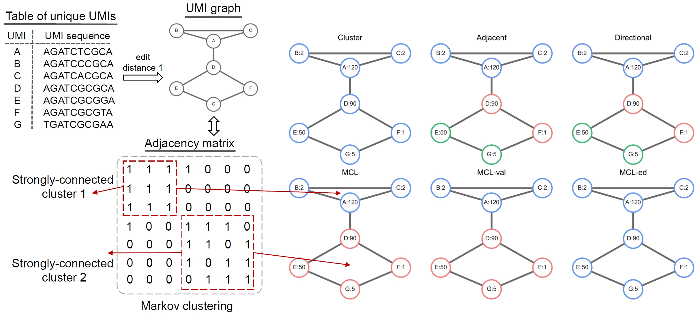
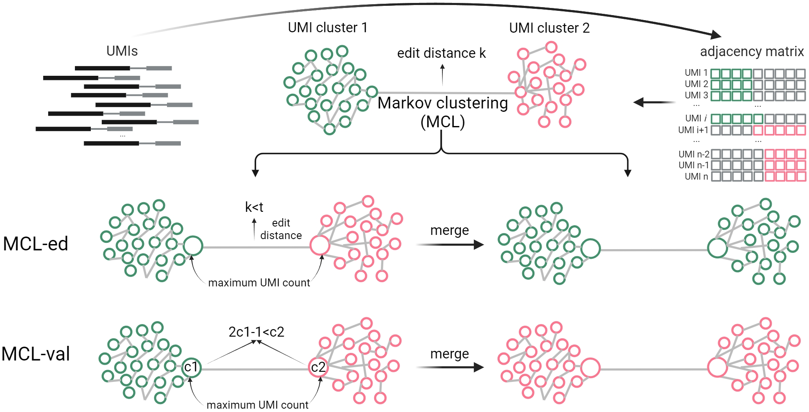

We developed mclUMI for automatic detection of UMI clusters without the need for calculating UMI counts by the Markov clustering algorithm. It has two derivatives, MCL-val and MCL-ed, by considering information about UMI counts.

<figure markdown="span">
  { width="800" }
  <figcaption><strong>Fig</strong> 1. Illustration of MCL for UMI deduplicating on a 7-node UMI graph</figcaption>
</figure>

* MCL-val's main thrust bears a very close resemblance to the Directional method. Rather than collapsing UMIs at the node level, MCL-val collapses UMIs at the subcomponent level. MCL-val first picks out UMIs with the highest count from Markov clusters and merges two Markov clusters if the count of one of the most commonly seen UMIs is at least above 2-fold higher than that of the other one.
* Because the difference between counts of UMIs A and B falls short of the requirement, the two Markov clusters are not merged. Building on subcomponent level, we further designed MCL-ed, which merge two Markov clusters if the two most commonly seen UMIs are k edit distance apart. For the 7-node UMI graph in the following plot, the two Markov clusters are merged because UMIs A and B are within one edit distance.

!!! tip

    PCR artefacts or duplicates result from amplification of reads over multiple PCR cycles. Classification of PCR duplicates according to the same UMIs does not work when UMIs are synthesised and/or sequenced incorrectly because of DNA polymerase/sequencing errors. 

To tackle this problem, graph-based computational strategies are proposed by leveraging edit distances between UMIs to build UMI graphs, which prevail among deduplication methods (see [^1] for technical review). Similar to existing methods, mclUMI implements a Markov clustering algorithm for UMI collapsing based on a UMI graph. We began by exemplifying 7 UMIs for 10X V2 chemistry and constructing a UMI graph using an edit distance 1. Upon receiving the adjacency matrix of the UMI graph, mclUMI is asked to search for subcomponents with their respective nodes strongly connected. For instance, a UMI graph composed of 7 nodes is further split into two subcomponents. It shows high connectivity within each of them but low connectivity between them. Nevertheless, Markov clusters are discovered without leveraging the information on UMI counts.

<figure markdown="span">
  { width="800" }
  <figcaption><strong>Fig</strong> 2. Schematic of MCL for UMI deduplication</figcaption>
</figure>

By calculating edit distances between UMIs and setting an editing distance cutoff, a graph is built to graphically present intricate relationships between UMIs. Edges that are used to link UMIs together reflect connectivity between them. If considering UMI counts as node sizes, such a graph can essentially reflect how UMIs with a low count evolve from a UMI with a high count over error-prone PCR amplification and sequencing processes. However, it remains murky as to which UMIs in a graph are most appropriately grouped and considered to originate from the same origin. To cope with this challenge, UMI-tools meticulously designed a set of custom-built, expert-guided rules to construct two methods, Adjacency and Directional. Different from this notion, we conjecture that edges are highly informative to implicit relationships between UMIs and it might not suffice to find such relationships with custom-built rules especially from a large UMI graph containing a slew of edges. Building on this perspective, we set out to utilize Markov clustering (MCL)[^2], a graph-based clustering algorithm, to naturally and spontaneously discover subcomponents with high connectivity from a UMI graph. The MCL-based UMI collapsing process is briefly formulated as follows.

mclUMI is a Markov clustering (MCL) network-based software suite comprising two modules of mcl-val and mcl-ed, for precisely localizing unique UMIs and thus removing PCR duplicates. Different from all established methods, our MCL-based methods initially allow UMI nodes to be merged spontaneously based only on the connectivity of edges created by a given edit distance in each of connected components of a UMI-structured graph.

[^1]: Smith T, Heger A, Sudbery I. UMI-tools: modeling sequencing errors in Unique Molecular Identifiers to improve quantification accuracy. Genome Res [Internet]. 2017;27:491–9. Available from: http://genome.cshlp.org/content/27/3/491.abstract
[^2]: Azad A, Pavlopoulos GA, Ouzounis CA, Kyrpides NC, Buluç A. HipMCL: a high-performance parallel implementation of the Markov clustering algorithm for large-scale networks. Nucleic Acids Res [Internet]. 2018;46:e33–e33. Available from: https://doi.org/10.1093/nar/gkx1313