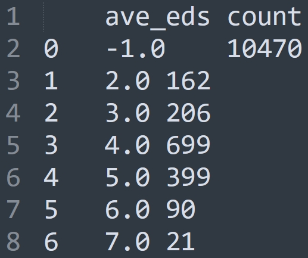
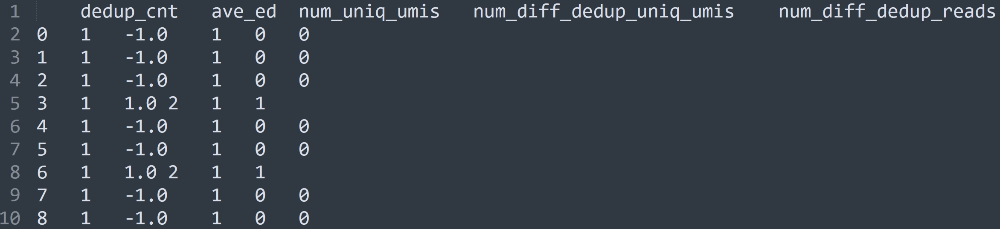
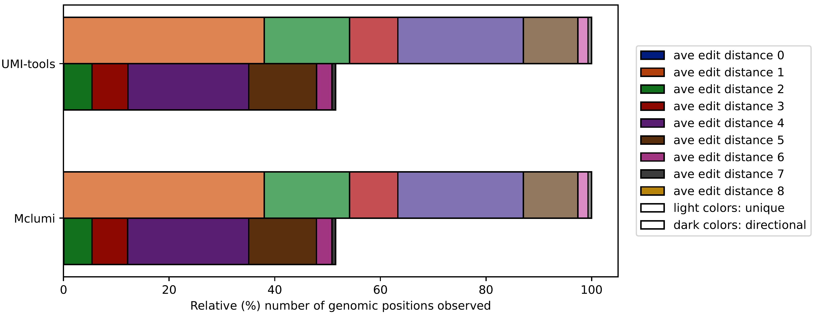

We set up a quick start here to guide you through an example to use mclUMI for UMI deduplication. Every module for this purpose in mclUMI provides 7 methods, that is, `unique`, `cluster`, `adjacency`, `directional`, `mcl`, `mcl_ed`, and `mcl_val` to handle precise unique UMI counting in the following application scenarios, 1). a single genomic locus, 2). multiple genomic loci, 3). genes, and 4). cell-by-gene types.

We present a case study for UMI deduplication according to genomic positions. In mclUMI, `mclumi.multipos` is responsible for UMI deduplication according to genomic positions, which allows users to deduplicate PCR artifacts/UMIs based on a set of genomic position annotations. In the quick start guide, we omit data preprocessing procedures and start by directly using a dataset ([a clip of ChIP-seq data](https://github.com/cribbslab/mclumi/releases/download/v0.0.1/example_bundle.bam) used also in UMI-tools) containing 1,175,027 reads with 20,683 raw unique UMI sequences and 12,047 genomic positions by running the UMI-tools `get_bundles` method. This method is also adopted by mclUMI. For details, please refer to the `mclumi.prep.run` module.

## Install

``` shell
pip install mclumi --upgrade
```

## Running

``` py linenums="1"
import mclumi as mu

df_mcl = mu.multipos.mcl(
    bam_fpn=to('data/example_bundle.bam'),
    ed_thres=1,
    pos_tag='PO',
    work_dir=to('data/'),
    verbose=False,  # False True

    heterogeneity=False,  # False True

    inflat_val=1.6,
    exp_val=2,
    iter_num=100,
)

print(df_mcl)

```

## Result

After running, mclUMI generates two files for UMI deduplication statistics and one bam file for deduplicated reads. Please see details at <a href="https://2003100127.github.io/mclumi/tutorial/I.-UMI-deduplication/1.-Single-locus/">4 different UMI deduplication levels</a>.

<figure markdown="span">
  { width="200" align=left }
  <figcaption><strong>Fig</strong> 1. Average edit distance observed at multiple genomic positions</figcaption>
</figure>

<figure markdown="span">
  { width="600" align=left }
  <figcaption><strong>Fig</strong> 2. Statistics of UMI deduplication using mclUMI</figcaption>
</figure>

!!! success "Comparison of *`Directional`* between mclUMI and UMI-tools"

    The directional algorithm in the UMI-tools suite has been reported to achieve the best expectancy in identifying PCR duplicates. In mclUMI, we re-implemented the directional method to familiarize ourselves with the UMI deduplication and ensure our further optimization work based on the correct path. We then proposed a more flexible method based on Markov clustering. What does the output of the directional module in both UMI-tools (see also [the results](https://umi-tools.readthedocs.io/en/latest/QUICK_START.html)) and mclUMI look like? **The same!** Please see below. 

<figure markdown="span">
  { width="800" }
  <figcaption><strong>Fig</strong> 3. Average edit distance distribution of genomic positions</figcaption>
</figure>